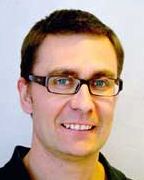

<!-- -*- mode: Markdown; fill-column: 80; indent-tabs-mode: nil; -*- -->

## Invited Talk

**Soft Software Engineering: Risks and Proposals for the Future**  
Robert Feldt, Chalmers University of Technology and The University of Gothenburg

<!-- 
 -->
<!--  -->
<!-- 
 -->

Within the general trend of considering more and more human and "softer" aspects
in Software Engineering, there has recently been a strong push for studying the
emotions of developers and engineers.  In this talk we look at some risks when
doing interdisciplinary research involving psychology, behavioural aspects, and
affect/emotion of software engineers.  Based on our experience from studies in
behavioural software engineering, we give some proposals for the future of
"soft" software engineering.
